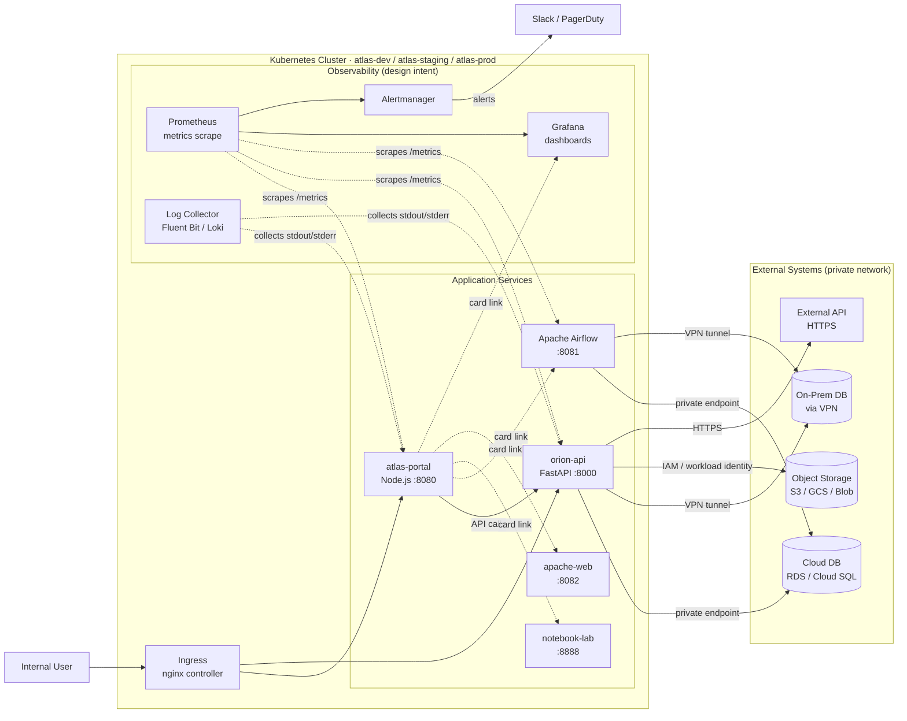
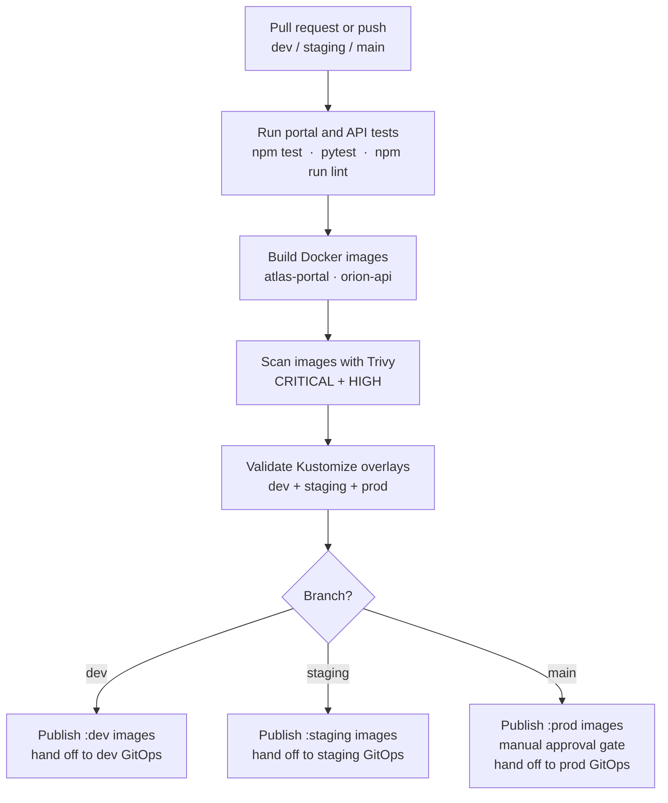
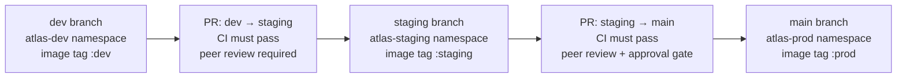

# Architecture

## System Architecture

The platform runs five services inside a Kubernetes cluster. All inbound traffic passes through an Ingress controller. The API service and Airflow connect to external data sources over private network paths. Monitoring and logging components observe all services from within the cluster.

**Legend:**
- Solid arrows `→` — direct API or data calls (runtime traffic)
- Dashed arrows `-.->` — portal UI card links (browser-side navigation) or monitoring collection
- Cluster subgraph — all services share the same Kubernetes namespace boundary per environment
- Observability layer — design intent; runtime components are outside assignment scope

---

## CI/CD Flow

The pipeline runs on every push and pull request to `dev`, `staging`, and `main`. Pull requests run tests and validation only; images are built and pushed on branch pushes.

> Pull requests stop after the Validate step — no images are built or pushed for PRs.

For the full pipeline stage descriptions and branch-mapping table, see [cicd-pipeline.md](cicd-pipeline.md).

---

## Release Promotion

Releases move from dev to staging to prod by pull request. Each promotion triggers a full CI run before merge. Production requires a manual approval gate.

For the full promotion process and environment differences, see [environments.md](environments.md).
