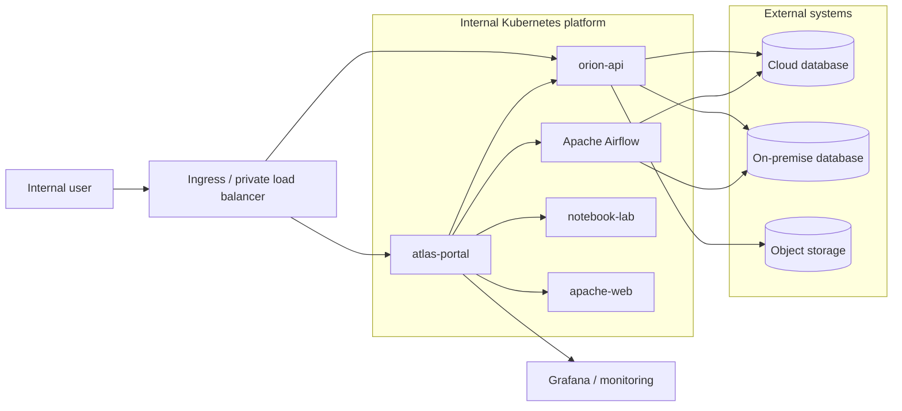
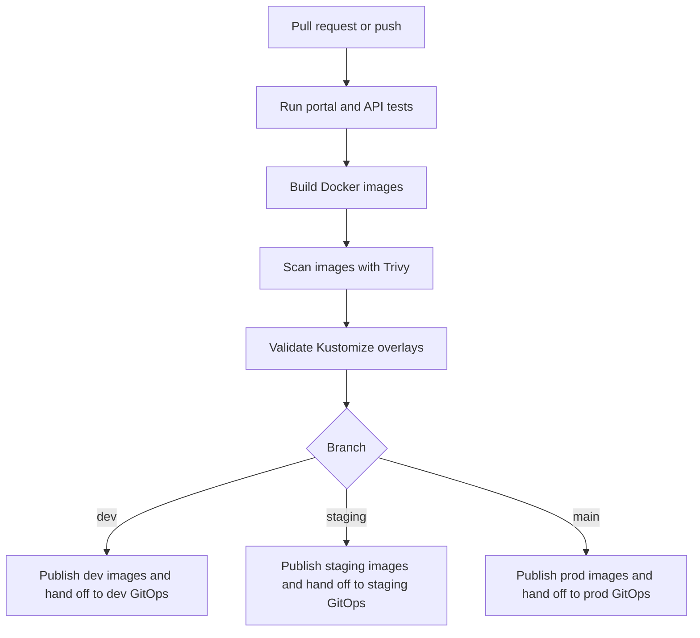
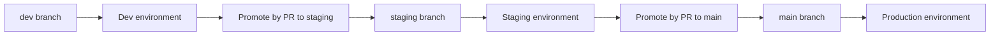

# Architecture Diagrams

## Architecture

```mermaid
flowchart LR
  User[Internal user] --> Ingress[Ingress / private load balancer]
  Ingress --> Portal[atlas-portal]
  Ingress --> API[orion-api]

  Portal --> API
  Portal --> Airflow[Apache Airflow]
  Portal --> Notebook[notebook-lab]
  Portal --> Apache[apache-web]
  Portal --> Grafana[Grafana / monitoring]

  API --> CloudDB[(Cloud database)]
  API --> OnPrem[(On-premise database)]
  API --> ObjectStore[(Object storage)]
  Airflow --> CloudDB
  Airflow --> OnPrem

  subgraph Kubernetes[Internal Kubernetes platform]
    Portal
    API
    Airflow
    Notebook
    Apache
  end

  subgraph External[External systems]
    CloudDB
    OnPrem
    ObjectStore
  end
```

## CI/CD Flow

```mermaid
flowchart TD
  PR[Pull request or push] --> Tests[Run portal and API tests]
  Tests --> Build[Build Docker images]
  Build --> Scan[Scan images with Trivy]
  Scan --> Validate[Validate Kustomize overlays]
  Validate --> Branch{Branch}
  Branch -->|dev| Dev[Publish dev images and hand off to dev GitOps]
  Branch -->|staging| Staging[Publish staging images and hand off to staging GitOps]
  Branch -->|main| Prod[Publish prod images and hand off to prod GitOps]
```

## Release Promotion

```mermaid
flowchart LR
  DevBranch[dev branch] --> DevEnv[Dev environment]
  DevEnv --> StagePR[Promote by PR to staging]
  StagePR --> StagingBranch[staging branch]
  StagingBranch --> StagingEnv[Staging environment]
  StagingEnv --> ProdPR[Promote by PR to main]
  ProdPR --> MainBranch[main branch]
  MainBranch --> ProdEnv[Production environment]
```
