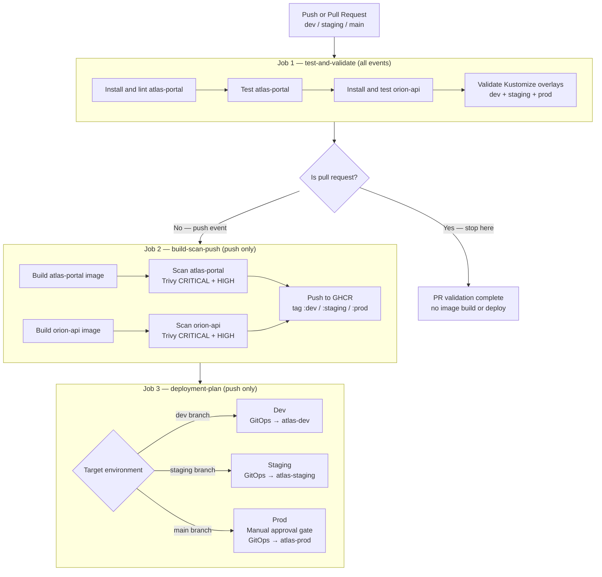
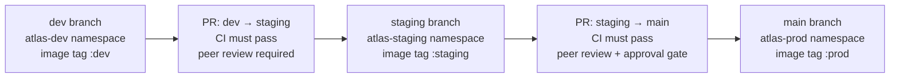

# CI/CD Pipeline

This document describes the pipeline defined in `.github/workflows/ci-cd.yaml`.

---

## Overview

The pipeline automates testing, image building, security scanning, and deployment validation for every code change. It runs on all pull requests and branch pushes to `dev`, `staging`, and `main`.

**Three jobs run in sequence:**

```
test-and-validate  →  build-scan-push  →  deployment-plan
(all events)          (push only)          (push only)
```

Pull requests run only the first job (`test-and-validate`) and stop there. No images are built or pushed for PRs.

---

## Trigger Conditions

| Event | Branches | Jobs that run |
|---|---|---|
| Pull request (opened / updated / synchronized) | `dev`, `staging`, `main` | `test-and-validate` only |
| Push (branch merge) | `dev`, `staging`, `main` | All three jobs |

---

## Job 1: test-and-validate

Runs on all events. Must pass before any build or deploy step.

| Step | Tool | What it does |
|---|---|---|
| Checkout | `actions/checkout@v4` | Fetches the repository at the triggering ref |
| Set up Node.js 20 | `actions/setup-node@v4` | Prepares the Node.js runtime |
| Install + lint portal | `npm install && npm run lint` | Installs dependencies and runs ESLint |
| Test portal | `npm test` | Runs the atlas-portal test suite |
| Set up Python 3.12 | `actions/setup-python@v5` | Prepares the Python runtime |
| Install + test API | `pip install -r requirements.txt && pytest` | Runs the orion-api test suite |
| Set up kubectl | `azure/setup-kubectl@v4` | Installs kubectl for manifest validation |
| Validate overlays | `kubectl kustomize k8s/overlays/<env>` | Validates dev, staging, and prod overlays |

If any step fails, the pipeline stops and the PR or push is blocked.

---

## Job 2: build-scan-push

Runs only on branch pushes. Depends on `test-and-validate` passing.

| Step | Tool | What it does |
|---|---|---|
| Prepare image names | bash | Derives `IMAGE_OWNER` and `IMAGE_TAG` from branch name |
| Set up Docker Buildx | `docker/setup-buildx-action@v3` | Enables multi-platform build support |
| Login to GHCR | `docker/login-action@v3` | Authenticates with `GITHUB_TOKEN` — no extra secret needed |
| Build atlas-portal | `docker/build-push-action@v6` | Builds image from `apps/atlas-portal/` |
| Build orion-api | `docker/build-push-action@v6` | Builds image from `apps/orion-api/` |
| Scan atlas-portal | `aquasecurity/trivy-action@v0.35.0` | Scans for CRITICAL and HIGH CVEs |
| Scan orion-api | `aquasecurity/trivy-action@v0.35.0` | Scans for CRITICAL and HIGH CVEs |
| Push atlas-portal | `docker/build-push-action@v6` | Pushes to GHCR with environment tag |
| Push orion-api | `docker/build-push-action@v6` | Pushes to GHCR with environment tag |

> **Note on Trivy:** The current configuration uses `exit-code: 0` — findings are reported in the workflow log but do not block the build. For production, set `exit-code: 1` to fail the pipeline on critical findings.

---

## Job 3: deployment-plan

Runs only on branch pushes. Depends on `build-scan-push` passing.

This job documents the deployment handoff. It logs which environment the current branch targets and the recommended deployment command.

**Deployment method (in order of preference):**
1. **GitOps controller** (Argo CD or Flux) — watches the branch and applies the overlay automatically when new images are available
2. **Manual fallback** — `kubectl apply -k k8s/overlays/<env>` run by a platform engineer

Production deployments should add a **GitHub Environment approval gate** (see below) before this job executes.

---

## Branch-to-Environment Mapping

| Branch | Environment | Namespace | Image tag | Auto-deploy |
|---|---|---|---|---|
| `dev` | Development | `atlas-dev` | `:dev` | Yes (GitOps) |
| `staging` | Staging | `atlas-staging` | `:staging` | Yes (GitOps) |
| `main` | Production | `atlas-prod` | `:prod` | After manual approval |

---

## Image Tagging Strategy

The branch name maps directly to the image tag:

| Branch | `atlas-portal` tag | `orion-api` tag |
|---|---|---|
| `dev` | `ghcr.io/<org>/atlas-portal:dev` | `ghcr.io/<org>/orion-api:dev` |
| `staging` | `ghcr.io/<org>/atlas-portal:staging` | `ghcr.io/<org>/orion-api:staging` |
| `main` | `ghcr.io/<org>/atlas-portal:prod` | `ghcr.io/<org>/orion-api:prod` |

This keeps Kustomize image patches simple and predictable. The overlay for each environment always references the same tag (`:dev`, `:staging`, `:prod`) — no manifest update is needed when a new image is pushed.

> **For production hardening:** add an immutable SHA-based tag alongside the environment tag (e.g., `:prod-a3f8c12`) for rollback and audit traceability.

---

## Kustomize Validation

All three overlays are validated on every pipeline run — including pull requests — before any build step:

```bash
kubectl kustomize k8s/overlays/dev    > /tmp/dev.yaml
kubectl kustomize k8s/overlays/staging > /tmp/staging.yaml
kubectl kustomize k8s/overlays/prod   > /tmp/prod.yaml
```

This confirms that all overlay patches apply cleanly and that the resulting manifests are structurally valid. No cluster connection is required.

---

## GitOps Deployment Handoff

After images are pushed, a GitOps controller is the preferred deployment mechanism:

1. The controller (Argo CD or Flux) watches the `dev`, `staging`, or `main` branch
2. When the branch is updated (new commit merged), the controller detects drift between the cluster state and the desired state in Git
3. The controller syncs the target namespace to match the overlay
4. No manual intervention is needed for dev and staging
5. Production sync waits for a manual approval gate

If no GitOps controller is available, the deployment step falls back to:
```bash
kubectl apply -k k8s/overlays/<env>
```

---

## Manual Approval Gate for Production

Production deployments should require explicit human review before the deployment handoff runs. The recommended approach uses **GitHub Environments**:

1. Create a `production` GitHub Environment in the repository settings
2. Add **required reviewers** to that environment
3. Configure the `deployment-plan` job to target the `production` environment for `main` branch runs
4. The pipeline pauses at the handoff step until a designated reviewer approves in the GitHub UI
5. On approval, the GitOps controller is notified or `kubectl apply` is run

This prevents accidental production deployments from automated merges and creates an auditable approval record.

---

## Pipeline Flow Diagram



---

## Release Promotion Diagram



**Promotion rules:**
- No environment can be skipped — every change must pass through dev, then staging, before reaching prod
- Each PR triggers a full CI run against the target branch before merge is allowed
- The approval gate at the staging → main step ensures a human signs off before production deployment
- Emergency patches follow the same path at an accelerated pace; no shortcuts bypass staging
